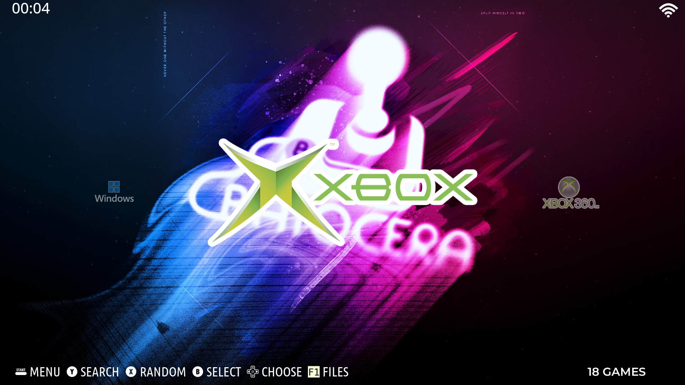
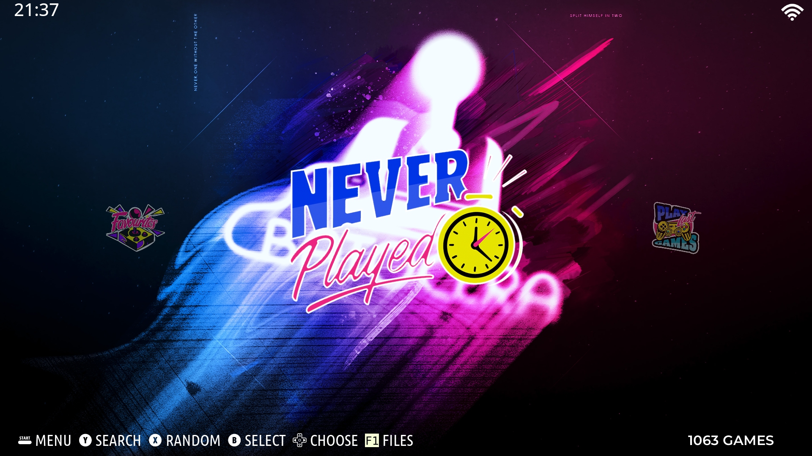
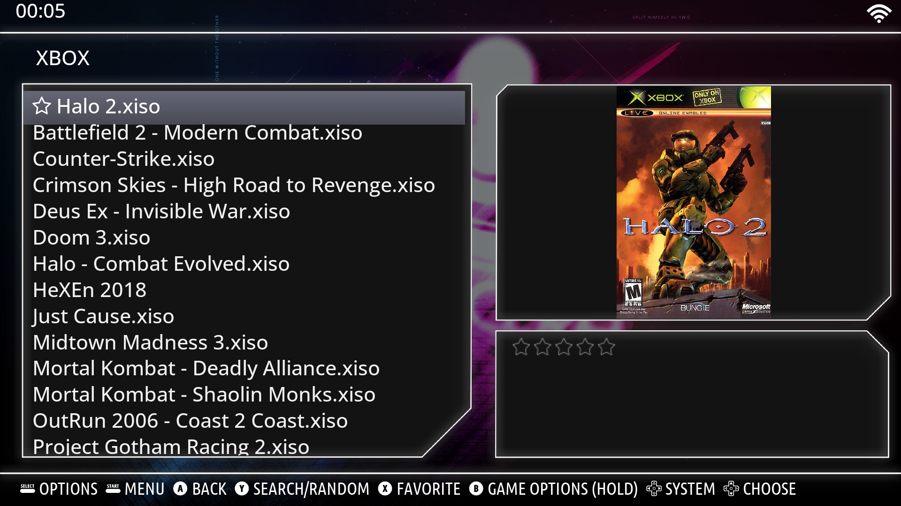
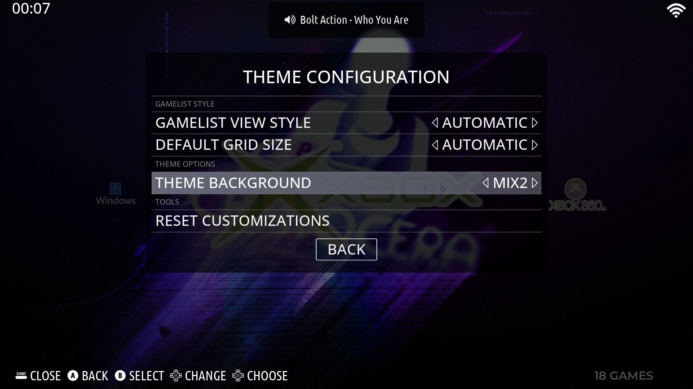
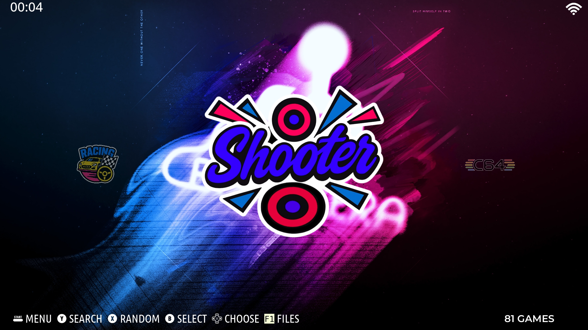
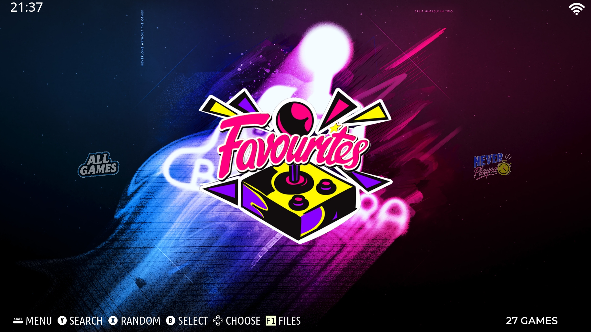
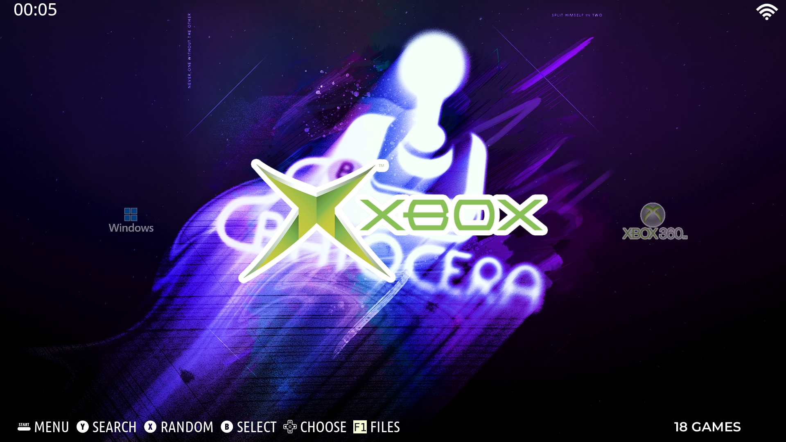
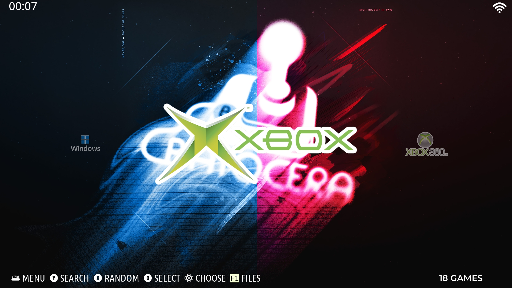
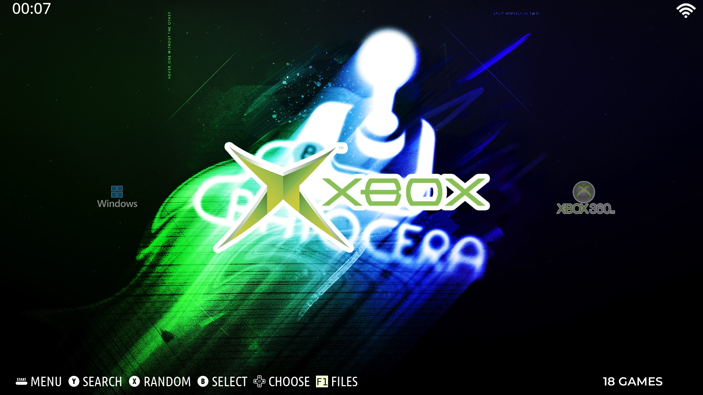
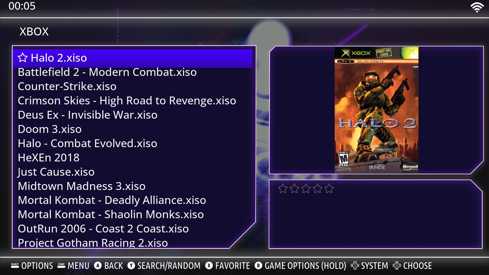

# Pulse Theme

A playful, modern dark theme for **Batocera Linux** with a cozy visual style, colorful wallpapers, and clean UI elements designed for both readability and performance.

## Overview

Pulse Theme gives your Batocera setup a modern and polished look while keeping navigation clear and responsive. It combines a dark aesthetic with playful icons, custom wallpapers, and multiple gamelist background styles.

## Features

- Clean dark aesthetic that keeps the focus on your games
- Playful custom icon set for added personality
- 10 colorful wallpapers to rotate or set as your favorite
- Sleek typography and clear focus states
- Lightweight assets for smooth performance on low-power devices
- 6 different gamelist background PNG styles

## Previews












## Compatibility

Tested with:

- Batocera **v40**
- Batocera **v41**
- Batocera **v42**
- Batocera **v43** (updated)

Recommended resolution:

- Best experience at **1080p**
- Scales well down to **720p**

## Installation

Enable **SSH** on your Batocera device or use the **F1 File Manager**.

Copy the theme folder to:

/userdata/themes/


Then go to:

**Main Menu → UI Settings → Theme Set**

Select **Batocera Pulse Theme**.

Optional: Open **Theme Configuration** to choose your preferred wallpaper variant.

## Customization

### Wallpapers

You can switch between **10 wallpapers** in the theme options.

### Gamelist Backgrounds

You can also choose between **6 gamelist background PNG styles** located in the `assets` folder.

## Changing the Gamelist Background

To use a different gamelist style, rename the desired file in `./assets` to:

```bash
gamelist.png
```

This replaces the default version with your preferred style.

## `theme2.xml` Version

`theme2.xml` includes a **light purple material-style accent color** instead of the default gray.

You can rename and adapt files as needed, similar to the different `gamelist.png` color variants.

## Gamelist Styles

* `main` → `gamelist.png`
* `shadow` → `gamelist_shadow.png`
* `dark` → `gamelist_dark.png`
* `light` → `gamelist_light.png`
* `purple` → `gamelist_purple.png`
* `mix` → `gamelist_mix.png`

## What Has Been Changed

* 10 new unique wallpapers by **sksdesign** (`MIX 1–10`)
* New and edited ART system logos
* New and edited theme icons
* 6 different gamelist styles
* Edited sound effect files
* Adjusted layout properties
* Additional layered PSD files
* Overhauled main theme aesthetics

## Supported Aspect Ratios

* **16:9** (PC)
* **4:3** (Handheld / Console)

## Supported Gamelist View Styles

* Basic
* Detailed
* Grid

## Included Backgrounds

* 10 custom Batocera Pulse wallpapers (`MIX 1–10`)

## Notes

* If you are upgrading from an older release, delete any cached theme data to avoid mixed assets.
* On very old GPUs, disabling transitions may improve smoothness.

## Author

### Batocera Pulse Theme

by **complicatiion** aka **sksdesign**

GitHub:
[https://github.com/complicatiion](https://github.com/complicatiion)

## Based On

Batocera Pulse Theme is based on **ES-A-StarWars-Theme** by **soaremicheledavid**.

GitHub:
[https://github.com/soaremicheledavid/ES-A-StarWars-Theme](https://github.com/soaremicheledavid/ES-A-StarWars-Theme)
[https://github.com/soaremicheledavid/](https://github.com/soaremicheledavid/)

## Acknowledgments

* Fonts source: [https://fonts.google.com/](https://fonts.google.com/)
* Logos source: [https://commons.wikimedia.org/](https://commons.wikimedia.org/)
* Icons and images customized in Photoshop

## License

**CC BY-NC-SA 4.0**
SMD & complicatiion aka sksdesign ©

You are free to:

* **Share** — copy and redistribute the material in any medium or format
* **Adapt** — remix, transform, and build upon the material

The licensor cannot revoke these freedoms as long as you follow the license terms.

Under the following terms:

* **Attribution** — You must give appropriate credit, provide a link to the license, and indicate if changes were made.
* **NonCommercial** — You may not use the material for commercial purposes.
* **ShareAlike** — If you remix, transform, or build upon the material, you must distribute your contributions under the same license as the original.
* **No additional restrictions** — You may not apply legal terms or technological measures that legally restrict others from doing anything the license permits.

See also: `LICENSE.md`

## Special Thanks

* soaremicheledavid
* Batocera Linux Developers
* EmulationStation DE Developers
* The entire emulation community

## Enjoy

Enjoy the mix of a minimal and playful theme.

## Note

This Theme is currently in active development!

